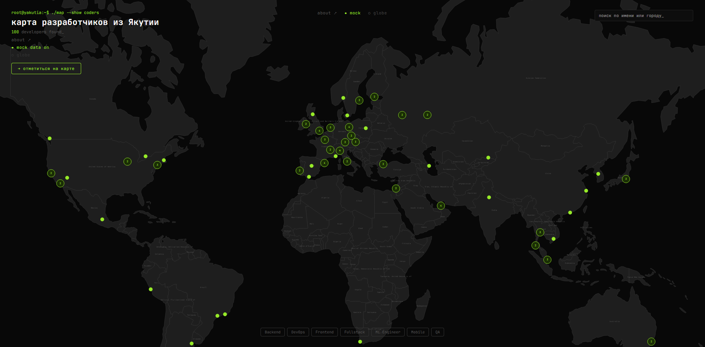
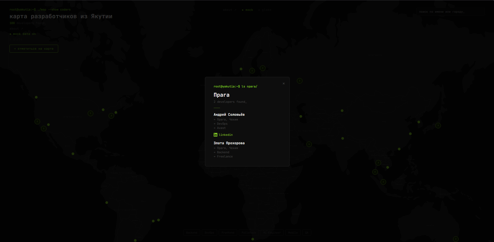
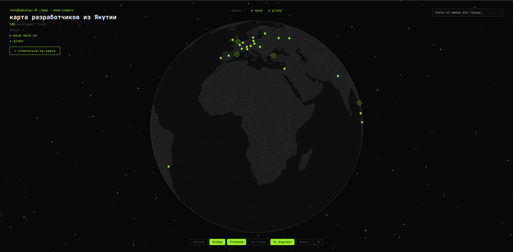

# карта разработчиков из Якутии

```
root@yakutia:~$ cat README.md
```

Интерактивная карта разработчиков из Якутии и якутского IT-сообщества по всему миру.
Отмечай себя, находи земляков по городу или специализации, следи за ростом комьюнити в реальном времени.

---

## → скриншоты





---

## → как это работает

- Нажми «отметиться на карте» и заполни форму
- Твоя точка появится на карте мгновенно у всех онлайн
- Кликай на точки чтобы смотреть профили
- Фильтруй по специализации через теги снизу
- Ищи по имени или городу через поиск справа
- Переключись в режим глобуса — кнопка «globe» в левом углу

## → стек

- React + Vite
- D3.js + TopoJSON — карта и визуализация
- Versor — вращение 3D глобуса через кватернионы
- Supabase — база данных и realtime
- Nominatim — геокодинг городов

## → ссылки

- [GitHub](https://github.com/yokithaiii/yktcoders-worldmap)
